<div align="center">


<h1>DDoS + WAF Baseline</h1>

<p><strong>The Enterprise Standard for Designing, Automating, and Governing Layered Application Protection</strong></p>

[]()
[]()
[]()
[]()

<br/>

> **"Availability is the heartbeat of the digital enterprise."** 
> DDoS + WAF Baseline is a flagship platform designed to enable enterprises to design, deploy, and scale layered application defense across multi-cloud and hybrid estates.

</div>

---

## 🏛️ Executive Summary

**DDoS + WAF Baseline** is a flagship repository designed for Chief Information Security Officers (CISOs), Security Architects, and SRE Leaders. In an era of increasing cyber warfare and automated bot abuse, application availability and data integrity are under constant threat.

This platform provides an industrialized approach to **Application Protection**, delivering production-ready **WAF Rule Engines**, **DDoS Mitigation Patterns**, **Bot Defense Strategies**, and **Security Observability Dashboards**. It supports **Azure Front Door**, **AWS WAF**, **GCP Cloud Armor**, and **CDN Edges**, enabling teams to manage global security posture with a single, consistent policy framework.

---

## 💡 Why DDoS + WAF Matters

Application protection is the first line of defense in the digital estate:
- **Availability Assurance**: Mitigating volumetric and application-layer DDoS attacks to prevent downtime.
- **Data Integrity**: Blocking SQL injection, XSS, and RCE attacks that target sensitive enterprise data.
- **Bot Abuse Prevention**: Defending against credential stuffing, scraping, and inventory hoarding.
- **API Security**: Securing the modern application surface area against unauthorized access and abuse.

---

## 🚀 Business Outcomes

### 🎯 Strategic Security Impact
- **Industrialized Defense**: Standardizing how applications are protected across Azure, AWS, and GCP.
- **Reduced Risk**: Implementing OWASP Top 10 protections as a non-negotiable baseline for all web properties.
- **Operational Efficiency**: Automating rule deployment and false-positive tuning through policy-as-code.
- **Brand Protection**: Ensuring consistent user experiences by preventing outages and data breaches.

---

## 🏗️ Technical Stack

| Layer | Technology | Rationale |
|---|---|---|
| **Policy Engine** | Python, Terraform | High-performance automation of security policy lifecycle and rule synchronization. |
| **Control Plane** | FastAPI | High-performance API for request management and incident orchestration. |
| **Frontend** | React 18, Vite | Premium portal for attack insights, rule tuning, and security scorecards. |
| **IaC Foundation** | Terraform | Multi-cloud infrastructure consistency and edge security automation. |
| **Database** | PostgreSQL | Centralized repository for security metadata, attack history, and state. |
| **Observability** | Prometheus / Grafana | Real-time monitoring of blocked requests, attack volume, and latency. |

---

## 📐 Architecture Storytelling: 65+ Diagrams

### 1. Executive High-Level Architecture
The holistic vision of the enterprise application protection journey.

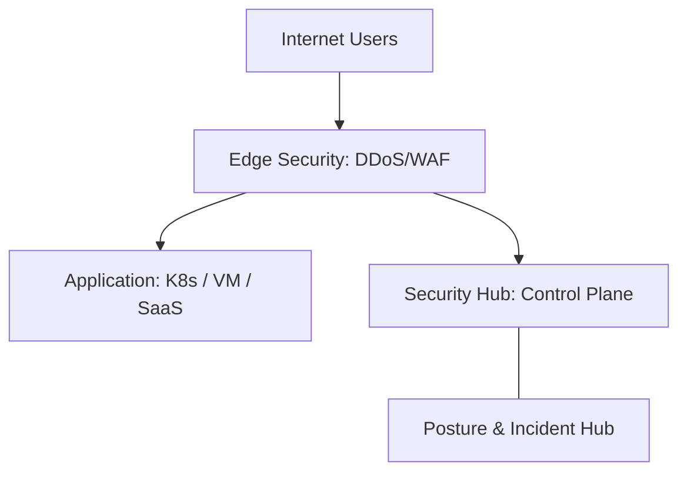

### 2. Detailed Component Topology
The internal service boundaries and management layers of the platform.

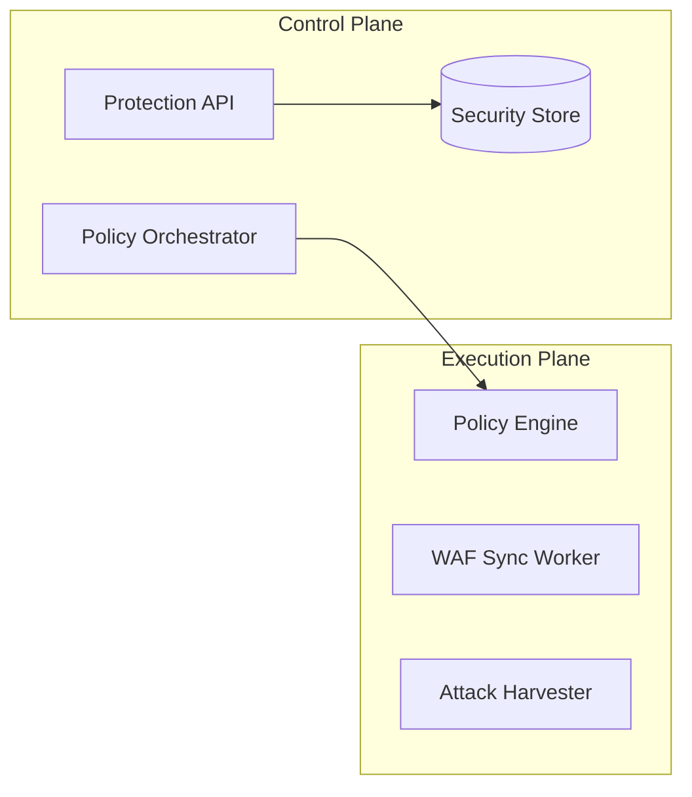

### 3. User to Edge Request Path
Tracing a request through the layered defense stack.

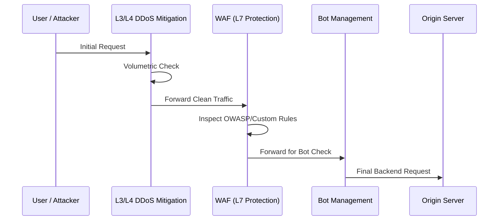

### 4. Protection Control Plane
The "Brain" of the framework managing global security definitions.

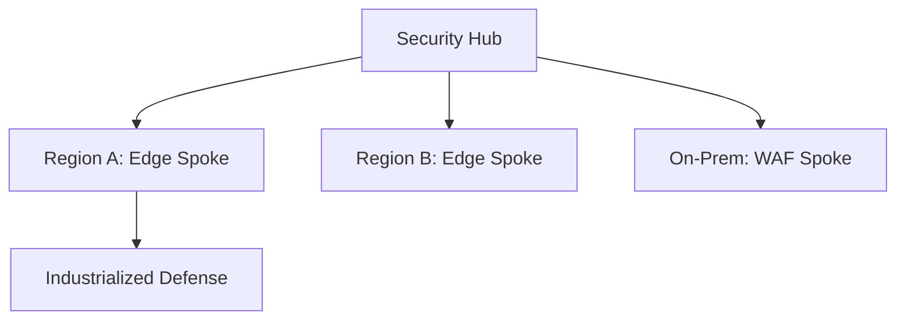

### 5. Multi-Cloud Edge Topology
Synchronizing security standards across Azure, AWS, and GCP.

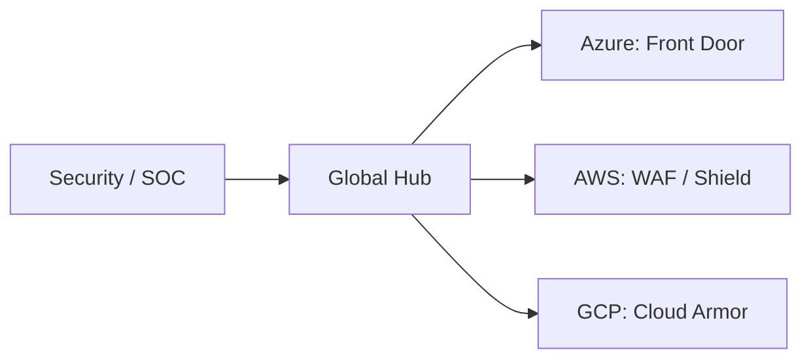

### 6. Regional Deployment Model
Hosting security workers close to the edge for performance.

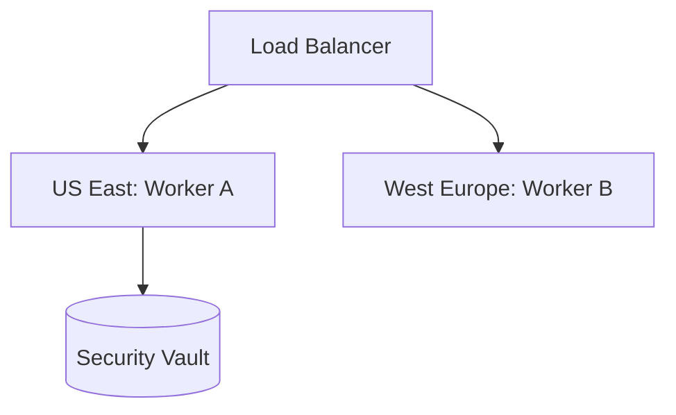

### 7. DR Failover Model
Ensuring security continuity during regional cloud outages.

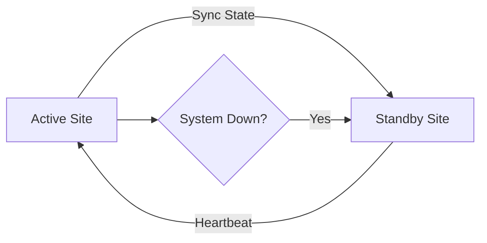

### 8. API Gateway Architecture
Securing and throttling the entry point for security orchestration.

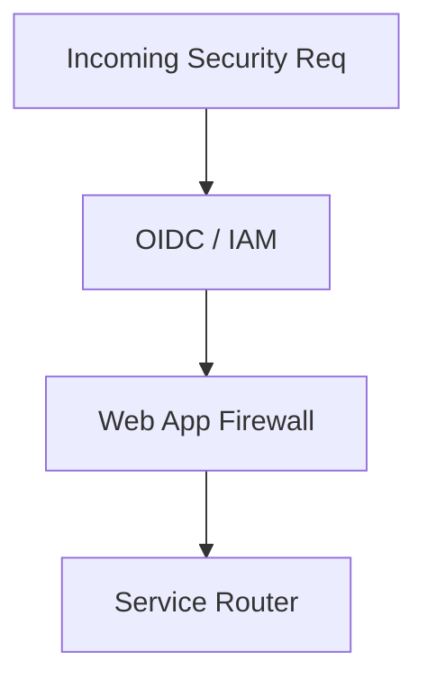

### 9. Queue Worker Architecture
Managing long-running policy sync and telemetry tasks at scale.

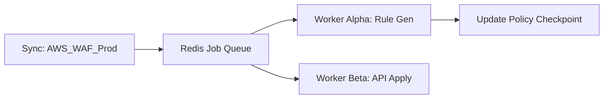

### 10. Dashboard Analytics Flow
How raw security telemetry becomes executive posture scorecards.

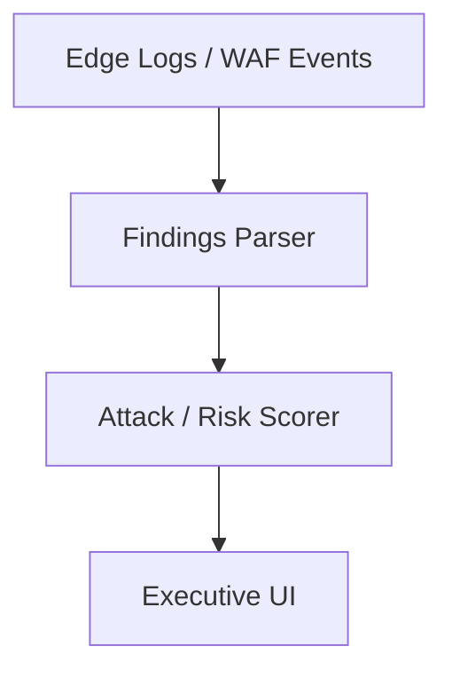

### 11. Volumetric Attack Mitigation Flow
Protecting the pipe from being overwhelmed by raw traffic.

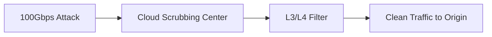

### 12. SYN Flood Protection Model
Mitigating resource exhaustion via half-open connections.

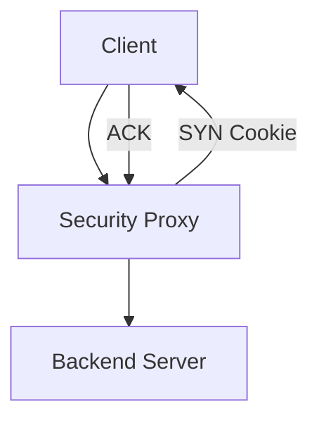

### 13. UDP Amplification Defense
Blocking spoofed UDP packets used in reflection attacks.

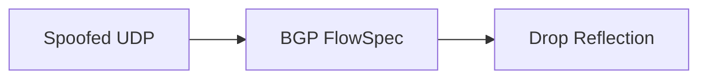

### 14. Scrubbing Center Workflow
Redirecting traffic during an active massive volumetric event.

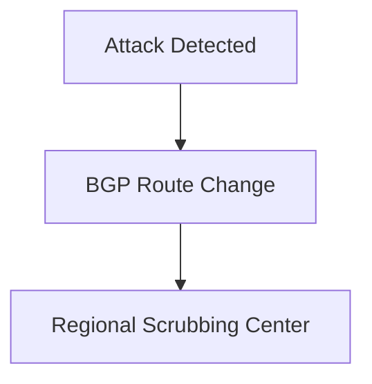

### 15. Auto-Scale Absorb Pattern
Using elastic edge capacity to handle traffic spikes.

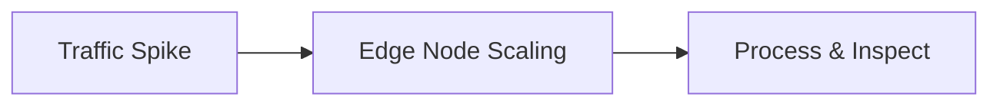

### 16. CDN Shielding Architecture
Hiding the origin IP behind a global CDN network.

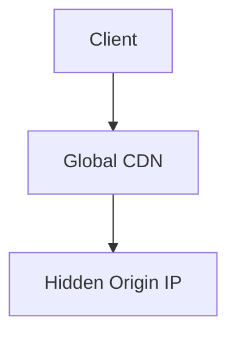

### 17. Multi-Region Failover Under Attack
Shifting traffic to a "Clean" region if the primary is saturated.

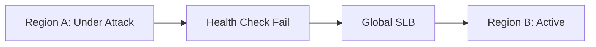

### 18. BGP Diversion Concept
How ISP-level mitigation is triggered for large-scale IP protection.

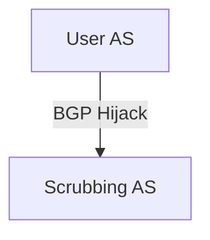

### 19. Origin Isolation Model
Ensuring only the WAF/CDN can talk to the backend.

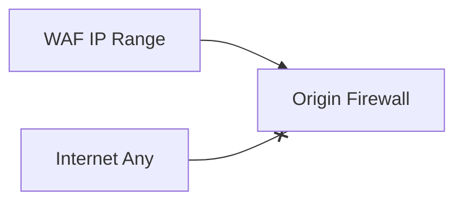

### 20. Attack Telemetry Lifecycle
From packet capture to SIEM alert.

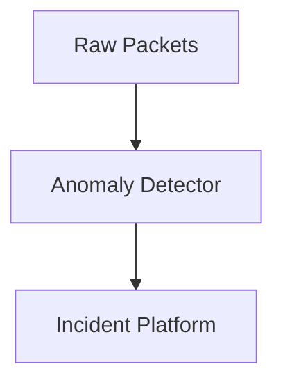

### 21. OWASP Top 10 Defense Map
Mapping WAF rule sets to specific web threat categories.

```mermaid
graph TD
    A1[Injection] --> Rule_SQLi[SQLi Rule Set]
    A2[Broken Auth] --> Rule_Bot[Bot Detection]
```

### 22. SQL Injection Block Flow
Detecting and dropping requests containing malicious SQL fragments.

```mermaid
graph LR
    Req[SELECT * FROM...] --> Signature[SQLi Pattern Match]
    Signature --> Block[403 Forbidden]
```

### 23. XSS Mitigation Workflow
Stripping or blocking script tags in user input.

```mermaid
graph TD
    Input[<script>...] --> Filter[XSS Clean]
    Filter --> Safe[Clean Content]
```

### 24. RCE Detection Model
Blocking attempts to execute system commands via web parameters.

```mermaid
graph LR
    Req[; cat /etc/passwd] --> RCE_Check[System Cmd Match]
    RCE_Check --> Drop[Drop Request]
```

### 25. Path Traversal Prevention
Stopping attackers from accessing sensitive files outside the web root.

```mermaid
graph TD
    Path[../../etc/shadow] --> Trav_Check[Directory Normalizer]
```

### 26. File Upload Protection
Scanning uploads for malicious extensions or signatures.

```mermaid
graph LR
    File[shell.php] --> Scan[Extension/MIME Verify]
```

### 27. Header Anomaly Detection
Identifying requests with suspicious or non-standard HTTP headers.

```mermaid
graph TD
    Header[User-Agent: bot] --> Anomaly[Header Inspector]
```

### 28. Virtual Patching Lifecycle
Quickly blocking a new vulnerability before the app can be patched.

```mermaid
graph LR
    CVE[New CVE] --> Rule[WAF Custom Rule]
    Rule --> Safe[Protected Origin]
```

### 29. Positive Security Model
Only allowing known-good traffic patterns (Allowlisting).

```mermaid
graph TD
    Pattern[API: /v1/user] --> Allow[Permit]
    Other[Any Other] --> Deny[Block]
```

### 30. False Positive Tuning Loop
The continuous process of refining rules to avoid blocking real users.

```mermaid
graph LR
    Block[Blocked User] --> Review[Log Review]
    Review --> Refine[Rule Exception]
```

### 31. API Rate Limiting Model
Preventing abuse by limiting requests per API key or client IP.

```mermaid
graph LR
    Req[Request] --> Counter[IP Bucket]
    Counter -->|Limit Met| 429[Too Many Requests]
```

### 32. JWT Validation Flow
Verifying authentication tokens at the edge before hitting the origin.

```mermaid
graph TD
    Token[JWT] --> Verify[Edge Sign Verify]
    Verify -->|Valid| Orig[Origin]
```

### 33. GraphQL Abuse Protection
Blocking excessively deep or complex GraphQL queries.

```mermaid
graph LR
    Query[Deep Query] --> Cost[Complexity Score]
    Cost -->|Too High| Block[Reject]
```

### 34. Credential Stuffing Defense
Detecting high-frequency login failures from common password lists.

```mermaid
graph TD
    Login[Failed Logins] --> Bot_Score[Bot Anomaly Index]
```

### 35. Bot Fingerprint Workflow
Using browser behavior and headers to distinguish humans from scripts.

```mermaid
graph LR
    Client[Client] --> Challenge[JS Challenge]
    Challenge -->|Pass| Human[Allow]
```

### 36. CAPTCHA Escalation Model
Triggering a visual challenge for suspicious traffic.

```mermaid
graph TD
    Sus[Suspicious] --> CAPTCHA[Display Challenge]
```

### 37. Token Bucket Throttling
Smoothly managing traffic bursts while maintaining strict limits.

```mermaid
graph LR
    Bucket[Bucket: 10 Tokens] --> Drain[Process Request]
```

### 38. Geo Blocking Workflow
Blocking or challenging traffic from specific countries.

```mermaid
graph TD
    IP[IP: 1.2.3.4] --> Geo[Lookup: Country X]
```

### 39. Reputation Feed Integration
Blocking known malicious IPs from global intelligence feeds.

```mermaid
graph LR
    Feed[Talos/AlienVault] --> Sync[Edge Blocklist]
```

### 40. Mobile API Protection Model
Ensuring only official apps can access the backend.

```mermaid
graph TD
    App[Mobile App] --> Attest[Device Attestation]
```

### 41. Azure Front Door + WAF Pattern
Standard Azure global edge protection.

```mermaid
graph LR
    AFD[Front Door] --> WAF_P[WAF Policy]
    WAF_P --> Origin[App Service/AKS]
```

### 42. AWS Shield + WAF Pattern
Standard AWS perimeter defense.

```mermaid
graph TD
    Shield[AWS Shield Advanced] --> WAF_C[AWS WAF]
    WAF_C --> ALB[App Load Balancer]
```

### 43. CloudFront + ALB + WAF Flow
Edge-to-origin protection on AWS.

```mermaid
graph LR
    CF[CloudFront] --> WAF[WAF]
    WAF --> Origin[Origin ALB]
```

### 44. GCP Cloud Armor Model
GCP native application protection.

```mermaid
graph TD
    Armor[Cloud Armor] --> GCLB[Global HTTP LB]
```

### 45. Kubernetes Ingress WAF
In-cluster protection using ingress controllers.

```mermaid
graph LR
    Ing[Nginx Ingress] --> ModSec[ModSecurity Lib]
```

### 46. NGINX ModSecurity flow
Legacy but powerful self-managed WAF pattern.

```mermaid
graph TD
    Req[Req] --> Nginx[Nginx]
    Nginx --> MS[ModSecurity Engine]
```

### 47. Kong gateway protection model
API-first security on Kong.

```mermaid
graph LR
    Kong[Kong] --> Plugin[WAF/Rate-Limit Plugins]
```

### 48. Private origin architecture
Securing the back-channel between the WAF and origin.

```mermaid
graph TD
    Edge[Edge] --> PL[Private Link]
    PL --> Origin[VNet Backend]
```

### 49. TLS termination workflow
Hardening cipher suites and protocols (TLS 1.2/1.3).

```mermaid
graph LR
    Handshake[Handshake] --> Cipher[Verify Cipher Strength]
```

### 50. Certificate rotation model
Automating SSL/TLS certificate updates via ACME.

```mermaid
graph TD
    Expiry[90 Days] --> Renew[Auto-Renew: CertBot]
```

### 51. OIDC / SSO Auth Flow
Securing the protection portal with enterprise identity.

```mermaid
graph LR
    User[Security Lead] --> OIDC[Okta / Azure AD]
```

### 52. RBAC Model
Defining permissions for security analysts, leads, and admins.

```mermaid
graph TD
    Role[Analyst] --> Action[View Logs Only]
```

### 53. Secrets Management Flow
Securing API keys for multi-cloud security automation.

```mermaid
graph LR
    KV[Key Vault] --> Inject[Worker Environment]
```

### 54. SIEM event pipeline
Exporting WAF/DDoS logs to Sentinel or Splunk.

```mermaid
graph TD
    Log[WAF Log] --> Pipe[Event Hub]
    Pipe --> SIEM[Sentinel]
```

### 55. Metrics Pipeline
Monitoring the performance of the security hub.

```mermaid
graph LR
    Hub[Hub] --> Prom[Prometheus]
```

### 56. Logging Architecture
Centralized security logs.

```mermaid
graph TD
    Edge[Edge Logs] --> Blob[Cloud Storage]
```

### 57. Tracing Model
Tracing security requests across distributed workers.

```mermaid
graph LR
    Req[Sync Policy] --> Trace[OTel Trace]
```

### 58. Incident escalation workflow
The bridge between detection and response.

```mermaid
graph TD
    High[Critical Attack] --> Pager[SOC Page]
```

### 59. Release pipeline governance
Governing updates to the security baseline.

```mermaid
graph LR
    Edit[Rule Change] --> Test[Baseline Test]
```

### 60. Change approval workflow
Ensuring all WAF changes are reviewed to prevent breakage.

```mermaid
graph TD
    Req[Prod WAF Change] --> CAB[Review Board]
```

### 61. Executive KPI Review Cycle
Reporting security metrics to the CISO.

```mermaid
graph LR
    Stats[Security Stats] --> Slide[Exec Deck]
```

### 62. Attack trend scorecard
Ranking applications by their threat profile.

```mermaid
graph TD
    Apps[Apps] --> Rank[P0: 1M Attacks]
```

### 63. MTTR workflow
Measuring the time to mitigate an active threat.

```mermaid
graph LR
    Detect[Detect] --> Mitigate[Mitigate]
    Mitigate --> MTTR[Calc: 4m]
```

### 64. Security maturity roadmap
The strategic journey from manual to autonomous defense.

```mermaid
graph TD
    P1[Reactive] --> P4[Adaptive]
```

### 65. Quarterly operating cadence
The rhythm of security reviews and posture hardening.

```mermaid
graph LR
    Q1[OWASP Update] --> Q4[Bot Hardening]
```

---

## 🔬 DDoS + WAF Protection Methodology

### 1. The Defense Pillars
Our platform is built on four core pillars:
- **Layered Defense**: Combining L3/L4 volumetric protection with L7 application awareness.
- **Precision**: Minimizing false positives through continuous rule tuning and anomaly detection.
- **Industrialization**: Automating security posture across diverse cloud and hybrid environments.
- **Observability**: Providing real-time visibility into the threat landscape and mitigation effectiveness.

### 2. DDoS Defense Strategy
- **L3/L4 (Volumetric)**: Absorbing massive floods via regional scrubbing centers and global edge capacity.
- **L7 (Application)**: Throttling suspicious request patterns and validating client authenticity.

---

## 🚦 Getting Started

### 1. Prerequisites
- **Terraform** (v1.5+).
- **Docker Desktop**.
- **Azure/AWS/GCP CLI** configured.

### 2. Local Setup
```bash
# Clone the repository
git clone https://github.com/Devopstrio/ddos-waf-baseline.git
cd ddos-waf-baseline

# Start the Protection Control Plane
docker-compose up --build
```
Access the Protection Portal at `http://localhost:3000`.

---

## 🛡️ Governance & Security
- **Immutable Policies**: WAF and DDoS policies are managed as code, ensuring versioned and audited changes.
- **Zero Trust Edge**: Origin servers are isolated to only accept traffic from the WAF/CDN IP ranges.
- **Continuous Posture Validation**: Automated scripts simulate common attacks to verify rule effectiveness.

---
<sub>&copy; 2026 Devopstrio &mdash; Engineering the Future of Industrialized Application Protection.</sub>
