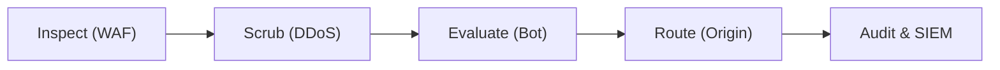
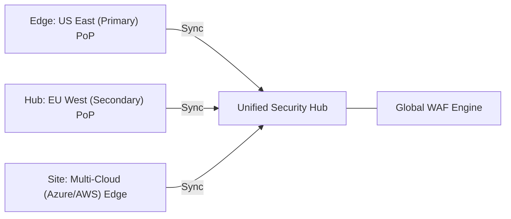
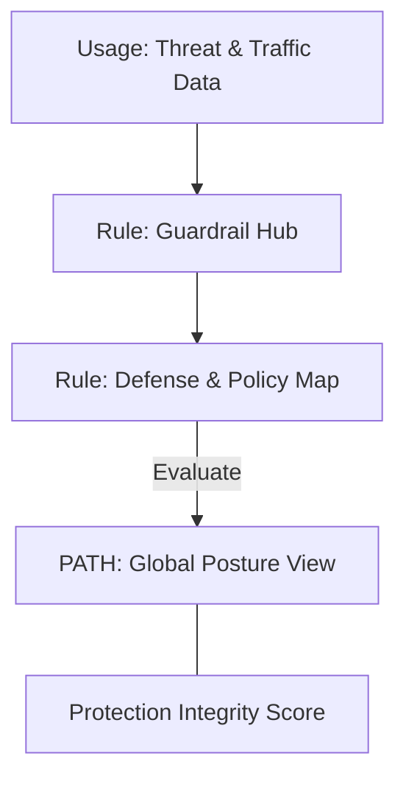
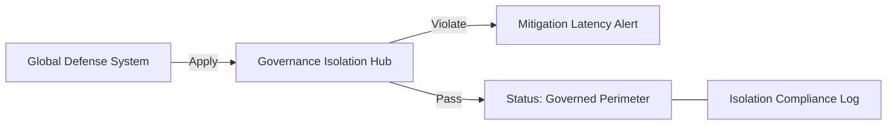
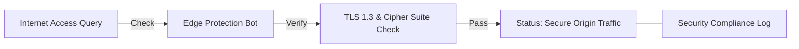
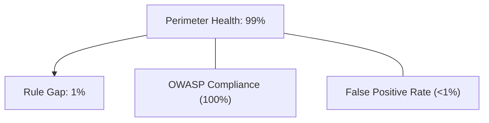
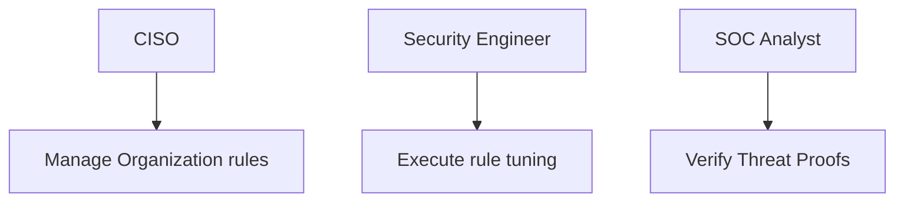
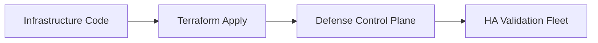
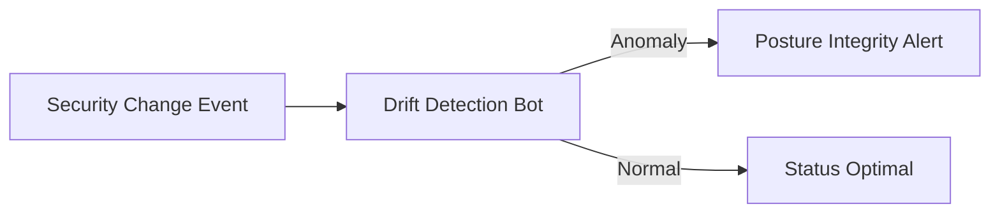
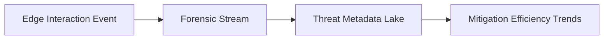

<div align="center">


<h1>DDoS + WAF Baseline</h1>

<p><strong>The Institutional-Grade Platform for Standardized Edge Defense, WAF Rule Governance, and Multi-Cloud Threat Ecosystems.</strong></p>

[]()
[]()
[]()

<br/>

> **"Industrializing edge defense to automate resilience foundations."** 
> **DDoS + WAF Baseline** is an enterprise-grade solution designed to provide a secure, measurable, and highly automated foundation for global application protection. It orchestrates the complex lifecycle of edge security—from WAF rule instantiation and volumetric DDoS scrubbing to bot mitigation and unified threat auditing.

</div>

---

## 🏛️ Executive Summary

Fragmented perimeter defenses and manual WAF tuning are strategic operational liabilities; lack of centralized edge orchestration is a primary barrier to organizational resilience and data security. Organizations fail to maintain a secure perimeter not because of a lack of firewalls, but because of fragmented rule standards, lack of automated threat validation, and an inability to orchestrate defense planes with operational precision.

This repository provides the **Edge Intelligence Plane**. It implements a complete **WAF-Baseline-as-Code Framework**, enabling Security and SRE teams to manage global application protection foundations as first-class citizens. By automating the identification of malicious traffic through real-time telemetry analysis and orchestrating the provisioning of secure performance-driven edge policies, we ensure that every organizational workload—from legacy APIs to modern SaaS platforms—is protected by default, audited for history, and strictly aligned with institutional security frameworks (OWASP, NIST).

---

## 📐 Architecture Storytelling: Principal Reference Models

### 1. Principal Architecture: Global Edge Security & WAF Intelligence Plane
This diagram illustrates the end-to-end flow from threat ingress and multi-cloud orchestration to edge enforcement, performance validation, and institutional security auditing.


```mermaid
graph LR
    %% Subgraph Definitions
    subgraph ThreatIngress["Traffic & Threat Ingress"]
        direction TB
        Public_Web["Public Internet / APIs"]
        Malicious_Bots["Automated Scrapers / Botnets"]
        Volumetric["L3/L4 DDoS Floods"]
    end

    subgraph IntelligenceEngine["Edge Intelligence Hub"]
        direction TB
        API["FastAPI Security Gateway"]
        RuleOrchestrator["Global WAF & CDN Hub"]
        Governance_Hub["Compliance & Standard Guardrail Hub"]
        AIOps_Validator["Threat & False Positive Analysis Hub"]
    end

    subgraph OperationsPlane["Distributed Defense Ecosystem"]
        direction TB
        ManagedEdges["Managed Standardized Cloud Edges"]
        ActiveRules["Managed Automated WAF Policies"]
        TelemetrySinks["Managed SIEM Delivery Hubs"]
    end

    subgraph OperationsHub["Institutional Security Hub"]
        direction TB
        Scorecard["Defense Maturity Scorecard"]
        Analytics["Attack Volume & Mitigation Velocity Stats"]
        Audit["Forensic Threat Metadata Lake"]
    end

    subgraph DevOps["WAF-Baseline-as-Code Framework"]
        direction TB
        TF["Terraform Edge Modules"]
        DriftBot["Rule & Config Drift Validator"]
        ChatOps["Security Operations Hub"]
    end

    %% Flow Arrows
    ThreatIngress -->|1. Submit Traffic| API
    API -->|2. Orchestrate Defense| RuleOrchestrator
    RuleOrchestrator -->|3. Apply Edge Guard| Governance_Hub
    Governance_Hub -->|4. Assess Threat| AIOps_Validator
    
    AIOps_Validator -->|5. Execute Mitigation| OperationsPlane
    OperationsPlane -->|6. Notify Incident| ChatOps
    API -->|7. Visualize Health| Scorecard
    
    Scorecard -->|8. Track Maturity| Analytics
    Scorecard -->|9. Record Mitigation| Audit
    
    TF -->|10. Provision Backbone| IntelligenceEngine
    DriftBot -->|11. Inject Posture Risk| RuleOrchestrator
    Audit -->|12. Improve Operations| ManagedEdges

    %% Styling
    classDef ingress fill:#f5f5f5,stroke:#616161,stroke-width:2px;
    classDef intel fill:#e8eaf6,stroke:#1a237e,stroke-width:2px;
    classDef operations fill:#e1f5fe,stroke:#01579b,stroke-width:2px;
    classDef ops fill:#ede7f6,stroke:#311b92,stroke-width:2px;
    classDef devops fill:#e8f5e9,stroke:#1b5e20,stroke-width:2px;

    class ThreatIngress ingress;
    class IntelligenceEngine intel;
    class OperationsPlane operations;
    class OperationsHub ops;
    class DevOps devops;
```

### 2. The Threat Defense Lifecycle Flow
The continuous path of an edge security platform from initial inspection (WAF) and scrubbing (DDoS) to active evaluation (Bot), routing (Origin), and institutional forensic auditing (SIEM).


```mermaid
graph LR
    Inspect["Inspect (WAF)"] --> Scrub["Scrub (DDoS)"]
    Scrub --> Evaluate["Evaluate (Bot)"]
    Evaluate --> Route["Route (Origin)"]
    Route --> Audit["Audit & SIEM"]
```

### 3. Distributed Edge Topology
Strategically orchestrating standardized WAF policies across global CDNs, cloud endpoints, and on-premises gateways, providing a unified institutional view of global perimeter health.


```mermaid
graph LR
    RegionA["Edge: US East (Primary) PoP"] -->|Sync| Hub["Unified Security Hub"]
    BU["Hub: EU West (Secondary) PoP"] -->|Sync| Hub
    Cloud["Site: Multi-Cloud (Azure/AWS) Edge"] -->|Sync| Hub
    Hub --- Logic["Global WAF Engine"]
```

### 4. Edge Governance & High-Trust Data Plane Protection Flow
Executing complex logic for securing the bridge between public internets, edge proxies, and private origins, ensuring every organizational identity is verified and every routing access is according to institutional standards.


```mermaid
graph TD
    SecurityData["Usage: Threat & Traffic Data"] --> Bridge["Rule: Guardrail Hub"]
    Bridge --> PolicyMap["Rule: Defense & Policy Map"]
    PolicyMap -->|Evaluate| Context["PATH: Global Posture View"]
    Context --- Estimate["Protection Integrity Score"]
```

### 5. Multi-Cloud Security Federation & WAF Governance Flow
Automatically managing unified Layer 7 standards across Azure Front Door, AWS WAF, and GCP Cloud Armor, ensuring institutional rule consistency and security boundaries by default.


```mermaid
graph LR
    Org["Global Defense System"] -->|Apply| Guard["Governance Isolation Hub"]
    Guard -->|Violate| Alert["Mitigation Latency Alert"]
    Guard -->|Pass| Verify["Status: Governed Perimeter"]
    Verify --- Audit["Isolation Compliance Log"]
```

### 6. Encryption & Perimeter Protection Flow (Edge Standard)
Managing the lifecycle of an incoming request, automatically enforcing institutional TLS 1.3, strict cipher suites, and origin isolation standards as required by security policy, ensuring zero-latency security confidence.


```mermaid
graph LR
    PublicReq["Internet Access Query"] -->|Check| Gatekeeper["Edge Protection Bot"]
    Gatekeeper -->|Verify| TLS["TLS 1.3 & Cipher Suite Check"]
    TLS -->|Pass| Admit["Status: Secure Origin Traffic"]
    Admit --- Audit["Security Compliance Log"]
```

### 7. Institutional Edge Maturity Scorecard
Grading organizational performance based on key indicators: OWASP Top 10 Compliance, False Positive Rates, and DDoS Incident Response Times.


```mermaid
graph TD
    Post["Perimeter Health: 99%"] --> Risk["Rule Gap: 1%"]
    Post --- C1["OWASP Compliance (100%)"]
    Post --- C2["False Positive Rate (<1%)"]
```

### 8. Identity & RBAC for Security Governance
Managing fine-grained access to WAF hubs, provisioning workers, and audit logs between CISOs, Security Engineers, and SOC Analysts.


```mermaid
graph TD
    CISO["CISO"] --> Hub["Manage Organization rules"]
    SecEng["Security Engineer"] --> Exec["Execute rule tuning"]
    SOC["SOC Analyst"] --> Audit["Verify Threat Proofs"]
```

### 9. IaC Deployment: WAF-Baseline-as-Code Framework
Using modular Terraform to deploy and manage the versioned distribution of the security tracking hubs, policy protection workers, and forensic metadata lakes.


```mermaid
graph LR
    HCL["Infrastructure Code"] --> TF["Terraform Apply"]
    TF --> Engine["Defense Control Plane"]
    Engine --> Clusters["HA Validation Fleet"]
```

### 10. AIOps Security Drift & Risk Validation Flow
Using advanced analytics to identify sudden surges in dropped requests, unauthorized origin bypasses, suspicious configuration drifts, or unusual traffic pattern changes that could result in institutional risk or downtime.


```mermaid
graph LR
    Drift["Security Change Event"] --> Analyzer["Drift Detection Bot"]
    Analyzer -->|Anomaly| Alert["Posture Integrity Alert"]
    Analyzer -->|Normal| Pass["Status Optimal"]
```

### 11. Metadata Lake for Forensic Threat Audit
Storing long-term records of every blocked request event (metadata), every volumetric attack mitigated, and every rule exception history for institutional record-keeping, compliance auditing, and post-provisioning forensics.


```mermaid
graph LR
    Provision["Edge Interaction Event"] --> Stream["Forensic Stream"]
    Stream --> Lake["Threat Metadata Lake"]
    Lake --> Trends["Mitigation Efficiency Trends"]
```

---

## 🏛️ Core Governance Pillars

1.  **Unified Foundation Coordination**: Maximizing resilience by centralizing all perimeter workflows through a single institutional plane.
2.  **Automated Policy Provisioning**: Eliminating "manual rule tuning" scenarios through proactive orchestration and pattern verification.
3.  **Sequential Defense Intelligence**: Ensuring zero-interruption operations through dependency-aware telemetry-driven edge engineering.
4.  **Zero-Trust Guardrail Protection**: Automatically enforcing identity-based access and origin isolation evaluation across all edge tiers.
5.  **Autonomous Operations Logic**: Guaranteeing reliability through automated industry-specific mitigation monitoring runbooks.
6.  **Full Threat Auditability**: Immutable recording of every WAF block and DDoS scrub for institutional forensics.

---

## 🛠️ Technical Stack & Implementation

### Security Engine & APIs
*   **Framework**: Python 3.11+ / FastAPI.
*   **Performance Engine**: Custom Python-based logic for multi-cloud rule provisioning and SOC-style readiness metrics.
*   **Integrations**: Native connectors for Azure Front Door, AWS WAF, GCP Cloud Armor, and ModSecurity.
*   **Persistence**: PostgreSQL (Security Ledger) and Redis (Live Defense State).
*   **Auth Orchestrator**: Federated OIDC/SAML for least-privilege perimeter management access.

### Governance Dashboard (UI)
*   **Framework**: React 18 / Vite.
*   **Theme**: Dark, Slate, Indigo (Modern high-fidelity security aesthetic).
*   **Visualization**: D3.js for attack topologies and Recharts for mitigation velocity analytics.

### Infrastructure & DevOps
*   **Runtime**: AWS EKS or Azure Kubernetes Service (AKS) for management plane.
*   **Security Hub**: Managed event sourcing for immutable threat timeline reconstruction.
*   **IaC**: Modular Terraform for deploying the defense landing zone and validation fleet.

---

## 🏗️ IaC Mapping (Module Structure)

| Module | Purpose | Real Services |
| :--- | :--- | :--- |
| **`infrastructure/defense_hub`** | Central management plane | EKS, PostgreSQL, Redis |
| **`infrastructure/edge_workers`** | Distributed automation workers | Azure, AWS, GCP APIs |
| **`infrastructure/telemetry_pipes`** | Defense Orchestration Hubs | Webhooks, Lambda |
| **`infrastructure/auditing`** | Forensic threat sinks | S3, Athena, Quicksight |

---

## 🚀 Deployment Guide

### Local Principal Environment
```bash
# Clone the DDoS WAF Baseline repository
git clone https://github.com/devopstrio/ddos-waf-baseline.git
cd ddos-waf-baseline

# Configure environment
cp .env.example .env

# Launch the Defense stack
make init

# Trigger a mock threat and automated guardrail validation simulation
make simulate-defense
```

Access the Management Portal at `http://localhost:3000`.

---

## 📜 License
Distributed under the MIT License. See `LICENSE` for more information.

---
<div align="center">
  <p>© 2026 Devopstrio. All rights reserved.</p>
</div>
